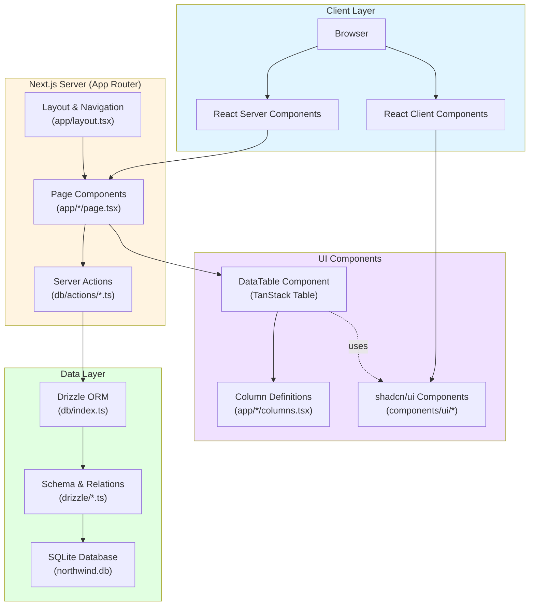

# Application Architecture

This diagram shows the overall architecture of the Next.js Northwind Starter application.

## Key Components

### Client Layer
- **Browser**: User interface running in the web browser
- **React Server Components**: Pages rendered on the server
- **React Client Components**: Interactive components (DataTable, UI components)

### Server Layer
- **Page Components**: Async server components that fetch and display data
- **Server Actions**: Type-safe data fetching functions marked with 'use server'
- **Layout & Navigation**: Root layout with sidebar navigation

### UI Components
- **shadcn/ui Components**: Reusable UI primitives (Button, Input, Table, Card, etc.)
- **DataTable Component**: Generic table with sorting, filtering, and pagination
- **Column Definitions**: Type-safe column configurations for TanStack Table

### Data Layer
- **Drizzle ORM**: Type-safe database client
- **Schema & Relations**: Database table definitions and relationships
- **SQLite Database**: Local file-based database (northwind.db)

## Technology Stack

- **Framework**: Next.js 15 with React 19 (App Router)
- **Database**: SQLite via better-sqlite3
- **ORM**: Drizzle ORM
- **UI**: shadcn/ui + Tailwind CSS 4
- **Tables**: TanStack Table (React Table v8)
