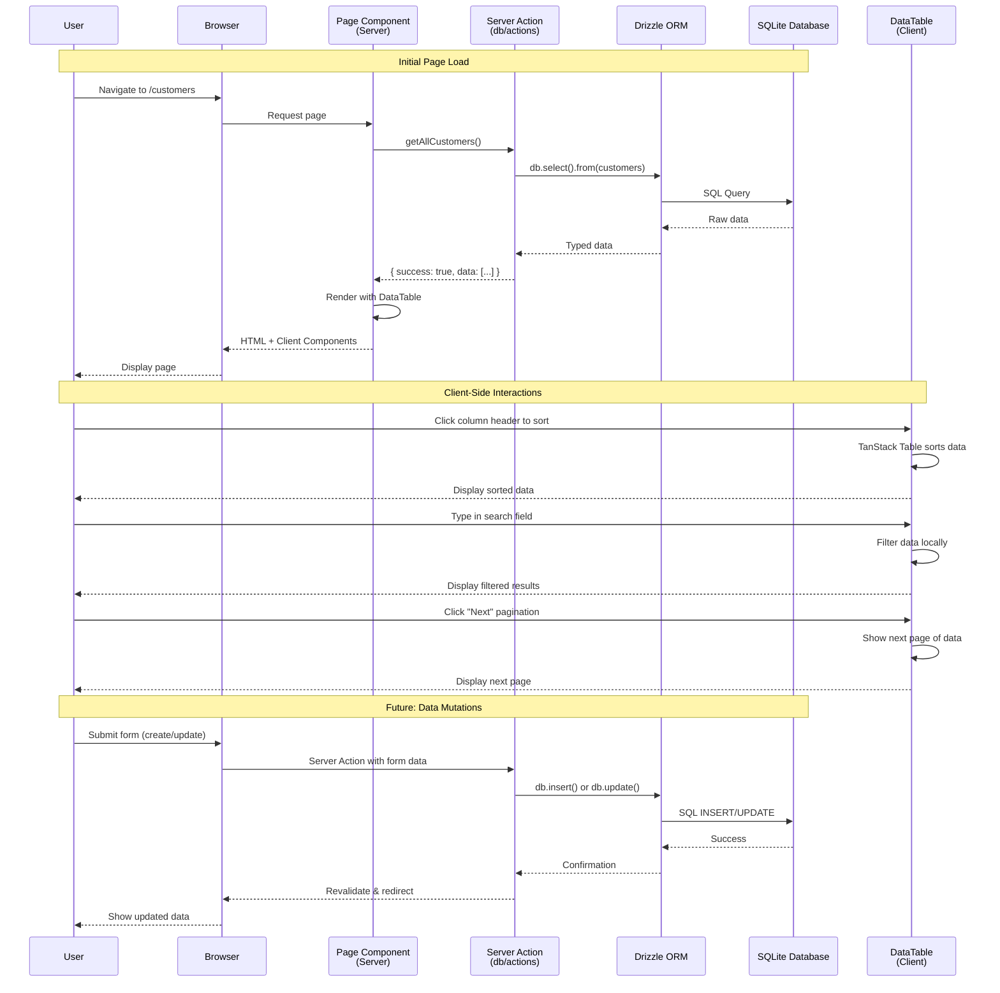

# Data Flow Diagram

This diagram illustrates how data flows through the application from user interaction to database and back.

## Data Flow Stages

### 1. Server-Side Rendering (SSR)
1. User navigates to a page (e.g., `/customers`)
2. Next.js executes the async Page Component on the server
3. Page Component calls Server Action (e.g., `getAllCustomers()`)
4. Server Action uses Drizzle ORM to query SQLite database
5. Data returns through the stack with full type safety
6. Page Component renders with data and sends HTML to browser

### 2. Client-Side Interactions
Once the page is loaded, all table interactions happen client-side:
- **Sorting**: TanStack Table handles sorting without server calls
- **Filtering**: Search/filter operates on client-side data
- **Pagination**: Navigation between pages happens client-side

### 3. Data Mutations (Future)
For create, update, delete operations:
1. User submits a form
2. Server Action receives and validates data
3. Drizzle ORM executes SQL mutation
4. Next.js revalidates cached data
5. User sees updated results

## Benefits of This Architecture

- **Type Safety**: End-to-end TypeScript from database to UI
- **Performance**: Server Components reduce client-side JavaScript
- **UX**: Client-side table interactions are instant (no network latency)
- **Security**: Database queries only run on server, never exposed to client
- **Developer Experience**: Clean separation of concerns with Server Actions
