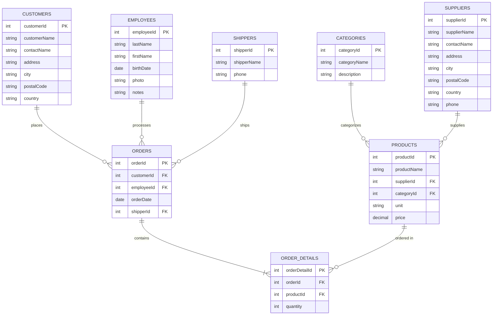

# Database Schema (Entity Relationship Diagram)

This diagram shows the Northwind database schema with all tables and their relationships.

## Entity Descriptions

### Core Business Entities

#### CUSTOMERS
Customer information including contact details and address.
- **Primary Key**: `customerId`
- **Relationships**: One customer can place many orders

#### EMPLOYEES
Employee records who process orders.
- **Primary Key**: `employeeId`
- **Relationships**: One employee can process many orders

#### PRODUCTS
Product catalog with pricing and inventory information.
- **Primary Key**: `productId`
- **Foreign Keys**:
  - `categoryId` → CATEGORIES
  - `supplierId` → SUPPLIERS
- **Relationships**:
  - Belongs to one category
  - Supplied by one supplier
  - Can appear in many order details

### Supporting Entities

#### CATEGORIES
Product categorization (e.g., Beverages, Condiments, Dairy Products).
- **Primary Key**: `categoryId`
- **Relationships**: One category contains many products

#### SUPPLIERS
Companies that supply products.
- **Primary Key**: `supplierId`
- **Relationships**: One supplier can supply many products

#### SHIPPERS
Shipping companies that deliver orders.
- **Primary Key**: `shipperId`
- **Relationships**: One shipper can ship many orders

### Transactional Entities

#### ORDERS
Customer orders processed by employees.
- **Primary Key**: `orderId`
- **Foreign Keys**:
  - `customerId` → CUSTOMERS
  - `employeeId` → EMPLOYEES
  - `shipperId` → SHIPPERS
- **Relationships**:
  - Placed by one customer
  - Processed by one employee
  - Shipped by one shipper
  - Contains many order details

#### ORDER_DETAILS
Line items in an order (junction table between Orders and Products).
- **Primary Key**: `orderDetailId`
- **Foreign Keys**:
  - `orderId` → ORDERS
  - `productId` → PRODUCTS
- **Relationships**:
  - Belongs to one order
  - References one product

## Key Relationships

1. **Customer → Orders**: One-to-Many
   - Each customer can place multiple orders

2. **Employee → Orders**: One-to-Many
   - Each employee can process multiple orders

3. **Order → Order Details**: One-to-Many
   - Each order contains multiple line items

4. **Product → Order Details**: One-to-Many
   - Each product can appear in multiple order details

5. **Category → Products**: One-to-Many
   - Each category contains multiple products

6. **Supplier → Products**: One-to-Many
   - Each supplier provides multiple products

7. **Shipper → Orders**: One-to-Many
   - Each shipper handles multiple orders

## Database Implementation

- **ORM**: Drizzle ORM
- **Database**: SQLite (northwind.db)
- **Schema Definition**: `drizzle/schema.ts`
- **Relations**: `drizzle/relations.ts`
- **Migrations**: Generated in `drizzle/` directory
